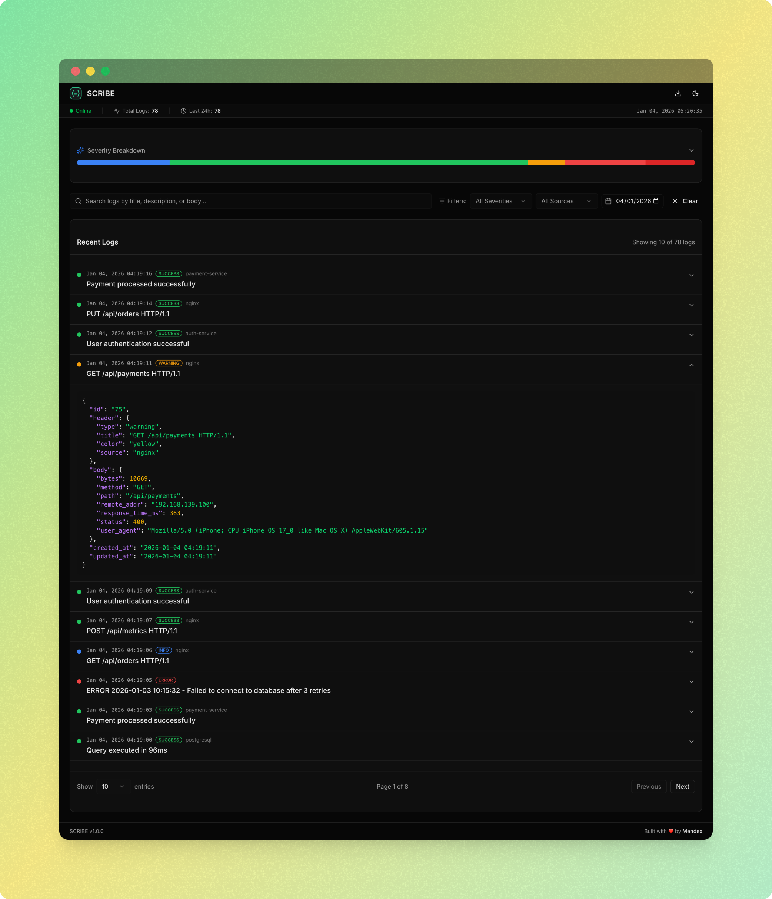

<p align="center">
  
</p>

<h1 align="center">SCRIBE</h1>

<p align="center">
  <strong>Smart logging for humans. Single binary. Zero dependencies.</strong>
</p>

<p align="center">
  <a href="https://github.com/mx-scribe/scribe/releases/latest"></a>
  <a href="https://github.com/mx-scribe/scribe/blob/main/LICENSE"></a>
  <a href="https://goreportcard.com/report/github.com/mx-scribe/scribe"></a>
  
  
</p>

<p align="center">
  <a href="#-quick-start">Quick Start</a> •
  <a href="#-features">Features</a> •
  <a href="#-performance">Performance</a> •
  <a href="#-api">API</a> •
  <a href="#-cli">CLI</a> •
  <a href="#-docker">Docker</a>
</p>

---

## What is SCRIBE?

SCRIBE is a **self-hosted logging solution** designed for indie developers, startups, and small teams who want powerful logging without the complexity.

```bash
./scribe serve
# That's it. Visit http://localhost:8080
```

<p align="center">
  
</p>

---

## 🚀 Quick Start

### One-liner Install

```bash
# Linux/macOS
curl -fsSL https://raw.githubusercontent.com/mx-scribe/scribe/main/install.sh | bash
```

### Manual Download

| Platform | Download |
|----------|----------|
| Linux (x64) | [scribe-linux-amd64.tar.gz](https://github.com/mx-scribe/scribe/releases/latest/download/scribe-linux-amd64.tar.gz) |
| Linux (ARM) | [scribe-linux-arm64.tar.gz](https://github.com/mx-scribe/scribe/releases/latest/download/scribe-linux-arm64.tar.gz) |
| macOS (Apple Silicon) | [scribe-macos-arm64.tar.gz](https://github.com/mx-scribe/scribe/releases/latest/download/scribe-macos-arm64.tar.gz) |
| macOS (Intel) | [scribe-macos-amd64.tar.gz](https://github.com/mx-scribe/scribe/releases/latest/download/scribe-macos-amd64.tar.gz) |
| Windows | [scribe-windows-amd64.zip](https://github.com/mx-scribe/scribe/releases/latest/download/scribe-windows-amd64.zip) |

```bash
# Extract and run
tar -xzf scribe-*.tar.gz
./scribe serve
```

---

## ✨ Features

| | Feature | Description |
|-|---------|-------------|
| 📦 | **Single Binary** | ~15MB, includes web dashboard, zero dependencies |
| 🗄️ | **SQLite Storage** | No external database, data in `~/.scribe/scribe.db` |
| 🧠 | **Smart Patterns** | Auto-detect severity and source from log content |
| 📊 | **Real-time Dashboard** | Beautiful UI with live SSE updates |
| 🔍 | **Dashboard Filters** | Filter by severity, source, date, and search |
| ⌨️ | **CLI & HTTP API** | Send logs from terminal or any language |
| 📤 | **Export** | JSON and CSV export |
| 🔒 | **Works Offline** | No cloud, no internet, fully self-hosted |
| 🔄 | **Easy Updates** | Replace binary, keep your data |

---

## 📈 Performance

> **We believe in honest metrics.** Here's exactly what SCRIBE can handle.

### Throughput

| Rate | Status | Errors | p95 Latency | Daily Capacity |
|------|--------|--------|-------------|----------------|
| **100/s** | ✅ Stable | 0% | 1ms | 8.6M logs |
| **150/s** | ✅ Stable | 0% | 1ms | 12.9M logs |
| **200/s** | ⚠️ Degraded | ~10% | 1ms | - |
| **500/s** | ❌ Overload | ~60% | 1ms | - |

### Resources

| Metric | Value |
|--------|-------|
| 📦 Binary size | ~15 MB |
| 💾 Memory (idle) | ~2 MB |
| 💾 Memory (load) | ~3 MB |
| 💿 Storage/log | ~370 bytes |

**Bottom line:** SCRIBE handles **12.9 million logs per day** on a single server. For most indie projects and startups, that's more than enough.

---

## ⌨️ CLI

### Server

```bash
scribe serve                      # Start on :8080
scribe serve --port 3000          # Custom port
scribe serve --db /data/logs.db   # Custom database
```

### Send Logs

```bash
scribe log "User signed up"
scribe log "Payment failed" --severity error
scribe log "Slow query" --severity warning --source postgresql
scribe log "Order #123" --body '{"total":99.99}'
```

### Query Logs

```bash
scribe logs                       # List recent
scribe logs --severity error      # Filter by severity
scribe logs --limit 100           # Limit results
scribe logs --format json         # JSON output
```

### Other Commands

```bash
scribe stats                      # Show statistics
scribe faker                      # Generate test logs
scribe faker --stress --rate 100  # Stress test
scribe version                    # Show version
```

---

## 🔌 API

### Send Logs

```bash
# Minimal (severity auto-detected from content)
curl -X POST http://localhost:8080/api/logs \
  -H "Content-Type: application/json" \
  -d '{"header":{"title":"User logged in"}}'

# Full example
curl -X POST http://localhost:8080/api/logs \
  -H "Content-Type: application/json" \
  -d '{
    "header": {
      "title": "Payment processed",
      "severity": "success",
      "source": "payment-service"
    },
    "body": {
      "amount": 99.99,
      "currency": "EUR"
    }
  }'
```

### Query & Export

```bash
# List logs
GET /api/logs
GET /api/logs?severity=error&limit=50
GET /api/logs?q=timeout

# Single log
GET /api/logs/{id}

# Statistics
GET /api/stats

# Export
GET /api/export/json
GET /api/export/csv

# Real-time (SSE)
GET /api/events

# Health
GET /health
GET /metrics
```

---

## 🧠 Smart Pattern Matching

SCRIBE automatically detects severity from log content:

| Pattern | Detected Severity |
|---------|-------------------|
| `HTTP 500`, `HTTP 502` | 🔴 error |
| `HTTP 400`, `HTTP 404` | 🟡 warning |
| `panic`, `fatal`, `critical` | 🔴 critical |
| `error`, `failed`, `crash` | 🔴 error |
| `warning`, `deprecated` | 🟡 warning |
| `success`, `completed` | 🟢 success |
| `SQL injection`, `brute force` | 🔴 critical |

Override anytime by specifying `severity` explicitly.

---

## 🐳 Docker

```dockerfile
FROM alpine:latest
COPY scribe /usr/local/bin/
VOLUME /data
EXPOSE 8080
CMD ["scribe", "serve", "--db", "/data/scribe.db"]
```

```bash
docker run -d -p 8080:8080 -v scribe-data:/data scribe
```

---

## ⚙️ Configuration

### Config File

Loaded from (in order):
1. `--config` flag
2. `./scribe.json`
3. `~/.scribe/config.json`
4. `/etc/scribe/config.json`

```json
{
  "server": {
    "port": 8080,
    "host": "0.0.0.0"
  },
  "database": {
    "path": "/data/scribe.db"
  }
}
```

### Environment Variables

```bash
SCRIBE_PORT=8080
SCRIBE_HOST=0.0.0.0
SCRIBE_DB_PATH=/data/scribe.db
```

---

## 🔄 Updating

Data is stored separately from the binary. Updates are simple:

```bash
# Download new version
curl -L https://github.com/mx-scribe/scribe/releases/latest/download/scribe-linux-amd64.tar.gz | tar xz

# Restart
./scribe serve
```

Your logs in `~/.scribe/scribe.db` are preserved.

---

## 📊 Comparison

| | SCRIBE | Loki | ELK Stack |
|-|--------|------|-----------|
| Setup | 1 min | Hours | Days |
| Dependencies | 0 | Many | Many |
| Memory | 2-3 MB | 500+ MB | 2+ GB |
| Dashboard | ✅ Built-in | ❌ Need Grafana | ✅ Kibana |
| Self-contained | ✅ | ❌ | ❌ |

SCRIBE isn't trying to replace enterprise logging. It's for developers who want **something that just works**.

---

## 📄 License

MIT License - see [LICENSE](LICENSE)

---

<p align="center">
  <strong>SCRIBE</strong> — Built with ❤️ by <a href="https://mendex.io">Mendex</a>
  <br><br>
  <em>Logging for developers who just want things to work.</em>
</p>
